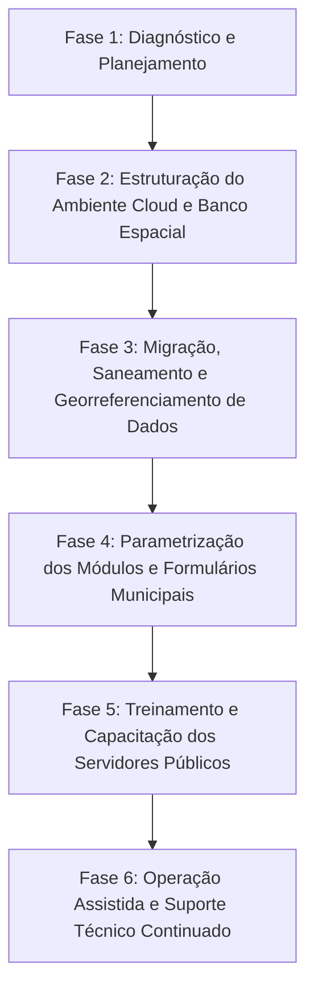

# TERMO DE REFERÊNCIA E PROPOSTA TÉCNICO-COMERCIAL
## PLATAFORMA INTEGRADA DE GESTÃO TERRITORIAL INTELIGENTE, CADASTRO TÉCNICO MULTIFINALITÁRIO (CTM) E PLANTA GENÉRICA DE VALORES (PGV)

---

### DADOS DO PROJETO E APRESENTAÇÃO
* **Documento:** Termo de Referência / Caderno de Especificações Técnicas e Proposta Comercial
* **Destinatários:** Prefeituras Municipais, Secretarias de Fazenda/Finanças, Planejamento Urbano, Obras, Habitação, Meio Ambiente e Tecnologia da Informação
* **Finalidade:** Fornecimento, implantação, parametrização, migração de dados e suporte continuado de Plataforma WebGIS Corporativa em Nuvem para Modernização do Cadastro Imobiliário Municipal, Apoio à Revisão da PGV, Fiscalização Urbana/Tributária e Gestão de Obras Públicas.
* **Compatibilidade Legal:** Em conformidade com a Lei Federal nº 14.133/2021 (Nova Lei de Licitações e Contratos), Lei Federal nº 13.465/2017 (REURB), Lei Federal nº 10.257/2001 (Estatuto da Cidade) e Diretrizes Nacionais do CTM (Portaria MCidades nº 511/2009).

---

## 1. DO OBJETO

O presente documento tem por objeto a contratação de **solução tecnológica integrada de Gestão Territorial Inteligente e Geoprocessamento Corporativo (WebGIS)**, operando em ambiente 100% web e computação em nuvem, com aplicativo progressivo para operação em campo (online e offline), destinada a:

1. **Estruturação, Modernização e Hospedagem da Base Cartográfica Municipal** (vetorial, raster, fotogrametria por drones e dados tridimensionais);
2. **Implantação do Cadastro Técnico Multifinalitário (CTM)** integrando dados físicos, jurídicos, fiscais e socioeconômicos dos imóveis urbanos e rurais;
3. **Suporte Técnico-Operacional à Atualização da Planta Genérica de Valores (PGV)**, viabilizando o combate à defasagem da base tributária municipal (IPTU, ITBI, Taxas de Serviços Urbanos e Contribuição de Melhoria) com justiça fiscal;
4. **Módulo de Fiscalização em Campo e Vistorias (Mobile Offline/Online)**, permitindo que auditores e fiscais realizem coletas cadastrais, vistorias de obras e registro fotográfico georreferenciado com sincronização instantânea;
5. **Módulo de Gestão de Obras Públicas e Intervenções Urbanas**, com acompanhamento físico-financeiro, relatórios fotográficos de medições e orçamentação geolocalizada;
6. **Módulo de Análise e Inteligência Espacial (Spatial Analytics e Comparador Temporal)** para detecção automatizada de expansões urbanas irregulares, loteamentos clandestinos e ampliações prediais não averbadas.

---

## 2. JUSTIFICATIVA E DIAGNÓSTICO DA REALIDADE MUNICIPAL

A arrecadação própria dos municípios brasileiros é historicamente prejudicada pela defasagem de seus cadastros imobiliários. Na maioria das administrações municipais, observa-se um dos dois cenários a seguir:

### Cenário A: Municípios Sem Base Cartográfica Digital Unificada
* Cadastros imobiliários puramente alfanuméricos em tabelas ou sistemas legados estáticos, sem vínculo com as dimensões e localizações reais do imóvel.
* Milhares de metros quadrados de ampliações prediais (reformas, novas construções, piscinas, galpões comerciais) executadas sem habite-se e omitidas da tributação.
* Perda substancial de receita em ITBI e IPTU, forçando o município à dependência excessiva do FPM (Fundo de Participação dos Municípios).
* Inexistência de mapas confiáveis para o planejamento de pavimentação, saneamento, iluminação e transporte público.

### Cenário B: Municípios com Base Cartográfica Existente, mas Obsoleta e Fragmentada
* Arquivos cartográficos dispersos em formatos estáticos (.DWG, .DXF, .SHP ou PDFs soltos em computadores locais de técnicos), gerando "ilhas de informação" incomunicáveis entre Obras, Fazenda e Meio Ambiente.
* Softwares pesados que exigem computadores de altíssimo custo e licenças de software desktop inviáveis para os servidores públicos.
* Falta de sincronização em tempo real: o fiscal em campo anota dados em pranchetas de papel, necessitando de redigitação manual e acarretando lentidão e erros humanos.

### A Solução Proposta
A nossa **Plataforma de Gestão Territorial Inteligente** resolve integralmente esses entraves através de um ecossistema digital acessível via navegador de qualquer dispositivo, unificando toda a prefeitura em uma **Única Fonte da Verdade Geográfica**, com alta performance de renderização (capaz de projetar mais de 25.000 lotes simultâneos a 60 FPS com zero travamento), inteligência espacial e segurança jurídica.

---

## 3. ARQUITETURA TECNOLÓGICA E DIFERENCIAIS DE DESEMPENHO

A plataforma foi desenvolvida sobre padrões tecnológicos de última geração, superando os tradicionais gargalos de lentidão observados em sistemas legados:

| Componente | Especificação Técnica | Benefício para o Município |
| :--- | :--- | :--- |
| **Arquitetura Web** | Single Page Application (SPA) responsiva com carregamento assíncrono modular | Acesso instantâneo via navegadores padrão (Chrome, Edge, Safari, Firefox), sem necessidade de instalação local de plugins ou softwares pesados. |
| **Motor Gráfico Dual (2D / 3D)** | **2D:** Leaflet Engine otimizado com indexação espacial R-Tree. **3D:** CesiumJS Engine para visualização de nuvens de pontos e gêmeo digital 3D. | Navegação ultrarrápida bidimensional e possibilidade de sobrevoo tridimensional sobre o relevo, terrenos e edificações da cidade. |
| **Indexação Espacial R-Tree (QuickRBush)** | Estrutura de dados em árvore $O(\log N)$ em memória e no cliente | Capacidade de manipular bases com mais de 30.000 lotes mantendo taxa de quadros estável a 60 FPS, eliminando travamentos de tela durante aproximações e arrastes. |
| **Cache Persistente Indexado (IndexedDB)** | Armazenamento de dados vetoriais e ortofotos em cache local validado com checksum | O usuário não precisa rebaixar a cidade inteira a cada carregamento de página. Consumo mínimo de tráfego de dados e abertura em menos de 1 segundo. |
| **Banco de Dados Espacial em Nuvem** | PostgreSQL com extensão espacial PostGIS e infraestrutura Supabase | Armazenamento em nuvem redundante com alta disponibilidade (99.9%), backup contínuo, criptografia de ponta a ponta e total conformidade com a LGPD. |
| **Sincronização em Tempo Real** | Websockets / PostgREST Realtime com agrupamento inteligente de eventos | Quando um fiscal altera um cadastro ou aprova um laudo em campo, os computadores da prefeitura recebem a atualização instantaneamente. |
| **Modo Campo Offline / PWA** | Progressive Web App com Service Worker e armazenamento local isolado | Fiscais podem trabalhar em áreas rurais ou bairros periféricos sem sinal de internet. Ao retornar à conexão, a sincronização é automática e à prova de perda de dados. |

---

## 4. ESPECIFICAÇÃO DETALHADA DOS MÓDULOS DO SISTEMA

### 4.1. Módulo de Cartografia Inteligente e Camadas Temáticas (GIS)
* **Gerenciamento Multicamadas Dinâmico:** Organização de camadas em grupos (Limites Municipais, Zoneamento Urbano, Bairros, Quadras, Lotes, Logradouros, Áreas Públicas, Equipamentos Comunitários, Áreas de Risco, Meio Ambiente, Obras, etc.).
* **Controle Avançado de Estilização Visual:** Customização de cores, larguras de arestas, estilos de linha (contínuo, tracejado), ícones temáticos para pontos e controle independente de transparência de aresta e transparência de preenchimento.
* **Importação e Exportação Multiformato:** Suporte nativo para importação e exportação de dados em formatos da indústria:
  * Vetoriais: **GeoJSON**, **Shapefile (.shp/.zip)**, **KML / KMZ**, **DXF (AutoCAD)**, planilhas **CSV/Excel com coordenadas**.
  * Imagens Raster: **GeoTIFF**, Ortomosaicos georreferenciados de Drones, Modelos Digitais de Elevação (MDE/MDT), conexões WMS/WMTS e camadas de satélite de alta definição.
* **Rotulagem Vetorial Dinâmica:** Exibição inteligente de rótulos (número do lote, quadra, inscrição, proprietário) com cálculo matemático de enquadramento geométrico (*culling espacial*) evitando poluição visual em escalas distantes.

### 4.2. Módulo de Cadastro Técnico Multifinalitário (CTM) e Vínculo Tributário
* **Ficha Cadastral Imobiliária Completa:**
  * Dados do Lote: Inscrição imobiliária, código cartográfico, área do terreno, testada principal, profundidade equivalente, topografia, pedologia e confrontações.
  * Dados da Edificação: Área construída real vs. área cadastrada, padrão construtivo, tipologia (residencial, comercial, industrial, mista), idade aparente, estado de conservação.
  * Dados Jurídicos e Dominiais: Nome do proprietário/compromissário, CPF/CNPJ, número de matrícula no Cartório de Registro de Imóveis (CRI), livro e folha.
  * Dados de Infraestrutura e Serviços Públicos: Pavimentação, rede de água, esgoto, energia elétrica, iluminação pública, coleta de lixo, drenagem pluvial e arborização.
* **Ferramenta de Junção e Cruzamento de Tabelas (Table Join / ETL):** Permite cruzar a base alfanumérica de qualquer software de arrecadação municipal com a base geográfica cartográfica através do código do imóvel ou inscrição imobiliária, revelando imediatamente:
  * Imóveis físicos sem cadastro no sistema tributário (inscrições fantasmas ou imóveis clandestinos).
  * Inscrições ativas sem correspondência física de lote (inconsistências fiscais).
  * Divergências entre a área construída tributada e a área real identificada na ortofoto.

### 4.3. Módulo de Suporte à Atualização da Planta Genérica de Valores (PGV)
* **Mapeamento de Valores Venais e Frentes de Quadra:**
  * Capacidade de associar valores unitários de metro quadrado de terreno ($VUT$) e de construção ($VUC$) por face de quadra, zona fiscal ou setor cadastral.
  * Cálculo instantâneo do valor venal do imóvel conforme os métodos preconizados pela ABNT NBR 14.653 (Avaliação de Imóveis Urbanos).
* **Mapas Temáticos de Graduação Fiscal:** Renderização de coropletos (mapas de calor por faixa de valor), permitindo simular cenários de impacto de arrecadação antes do envio de projetos de lei de atualização da PGV à Câmara Municipal.
* **Garantia de Justiça Fiscal:** Identificação de discrepâncias onde imóveis de alto padrão possuem valor venal defasado em relação a áreas populares, fornecendo embasamento técnico inquestionável para a administração.

### 4.4. Módulo de Vistorias em Campo e Fiscalização Urbana (Online / Offline)
* **Formulários Dinâmicos Customizáveis:** Capacidade de criar campos e formulários personalizados para cada setor da prefeitura (Fiscalização de Obras, Vigilância Sanitária, Posturas, Meio Ambiente, Defesa Civil e Regularização Fundiária).
* **Coleta de Evidências em Campo:**
  * Captura de fotografias diretamente pela câmera do celular/tablet, associadas à feição do imóvel com geolocalização e data/hora certificada.
  * Desenho e ajuste geométrico em campo (marcação de novos limites de muro, cercas ou construções).
* **Autonomia Operacional Sem Conexão:** Blindagem total para operação offline com fila de persistência local em IndexedDB; a equipe realiza o trabalho de campo completo e, ao ingressar na rede Wi-Fi da prefeitura ou sinal 4G, todas as vistorias são sincronizadas com segurança.

### 4.5. Módulo de Gestão de Obras Públicas e Projetos
* **Monitoramento Territorial de Obras:** Cadastro georreferenciado de todas as intervenções municipais (pavimentações, praças, pontes, creches, unidades de saúde, reformas).
* **Acompanhamento de Medições:** Registro de vistorias técnicas periódicas, upload de diários de obras, fotos de evolução física e monitoramento de percentuais de execução física e financeira.
* **Módulo Orçamentário Georreferenciado:** Levantamento métrico direto sobre o mapa (cálculo de extensão de guias, área de asfalto em $m^2$, volume de terraplanagem) gerando relatórios estimativos de insumos e custos.

### 4.6. Módulo de Análises Espaciais Avançadas (Spatial Analytics & Inteligência Urbana)
* **Comparador Temporal de Ortofotos (Swipe / Cortina Deslizante):** Ferramenta interativa de divisão de tela que permite comparar a ortofoto do ano base com imagens de satélite atuais ou voos de drone recentes, permitindo identificar visualmente construções não declaradas com facilidade.
* **Ferramentas Métricas Certificadas:** Medição de distâncias geodésicas, áreas poligonais, perímetros e cotas altimétricas.
* **Análise de Vizinhança e Áreas de Influência (Buffer Espacial):** Geração de raios de impacto para estudos de tráfego, licenciamento ambiental ou atendimento de equipamentos públicos (ex.: raio de 500m de postos de saúde ou escolas).
* **Painel Estatístico em Tela Cheia (Dashboard Analytics):** Gráficos dinâmicos de área territorial por zoneamento, distribuição de imóveis por bairro, quantitativos de obras ativas e índices de regularidade cadastral.

### 4.7. Módulo de Emissão de Relatórios Oficiais, Laudos Técnicos e BCI (A4 / PDF / DOCX)
* **Gerador Automatizado de Relatórios de Feição (ReportBuilder):**
  * Emissão em um clique do **Boletim de Cadastro Imobiliário (BCI)** oficial com cabeçalho institucional e brasão do município.
  * Inclusão automática do **Mapa de Situação e Localização** centrado no imóvel com escala e norte.
  * Galeria de fotografias da fachada e vistorias vinculadas.
  * Ficha de confrontações e tabela completa de atributos físicos e tributários.
* **Flexibilidade de Formato:** Exportação direta para formatos **PDF (pronto para impressão e assinatura digital)** e **DOCX (Microsoft Word editável)**, além de relatórios sintéticos tabulares em Excel/CSV.

### 4.8. Módulo de Segurança, Controle de Acesso e Conformidade LGPD
* **Autenticação Segura e Perfis de Acesso:** Controle granular de permissões (Administrador, Secretário, Fiscal, Técnico, Consulta Pública).
* **Auditoria Completa de Operações (Audit Trail):** Registro em banco de dados de cada ação executada (quem cadastrou, quem editou atributos, quem desenhou geometrias e quando ocorreu), assegurando integridade perante órgãos de controle (Tribunal de Contas e Ministério Público).
* **Proteção de Sessão Ativa:** Bloqueio automático por inatividade de 15 minutos em estações da prefeitura, garantindo que terceiros não acessem dados sensíveis.

---

## 5. BENEFÍCIOS QUANTITATIVOS E QUALIFICATIVOS PARA O MUNICÍPIO

| Dimensão | Benefício Direto para o Município |
| :--- | :--- |
| **Arrecadação Municipal** | **Aumento real e contínuo de 20% a 50% na receita própria de IPTU e ITBI** já no primeiro exercício, unicamente pela inclusão de áreas construídas omitidas e correções de categorias prediais, **sem necessidade de aumento de alíquotas**. |
| **Justiça Tributária** | Fim das distorções fiscais onde cidadãos de menor poder aquisitivo pagam proporcionalmente mais tributos que imóveis valorizados sem cadastro atualizado. |
| **Produtividade das Equipes** | **Redução de até 70% no tempo de vistoria em campo e elaboração de laudos**, eliminando planilhas impressas, retrabalho de digitação e deslocamentos desnecessários. |
| **Planejamento Urbano** | Decisões administrativas baseadas em dados geoespaciais fidedignos para investimentos em infraestrutura, asfaltamento, drenagem e equipamentos de saúde e educação. |
| **Atendimento ao Cidadão** | Rapidez na emissão de certidões de confrontação, alvarás de construção, numeração predial oficial e certidões de viabilidade locacional. |
| **Regularização Fundiária (REURB)** | Ferramenta nativa pronta para processar levantamentos topográficos e socioeconômicos exigidos pela Lei Federal nº 13.465/2017 para titulação de núcleos urbanos informais. |
| **Governança e Tribunal de Contas** | Transparência total com registros de auditoria em conformidade com as exigências dos Tribunais de Contas Estaduais (TCE). |

---

## 6. ESCOPO DOS SERVIÇOS E PLANO DE IMPLANTAÇÃO

A contratação contemplará todas as fases necessárias para entrega da solução em pleno funcionamento (*chave na mão*):

### Fase 1: Diagnóstico Inicial e Alinhamento Técnico (15 dias)
* Levantamento de todas as bases existentes na Prefeitura (DWG, Shapefiles, ortofotos de voos anteriores, planilhas fiscais de IPTU).
* Reunião com as Secretarias de Finanças, Obras e Planejamento para definição do modelo de dados prioritário.

### Fase 2: Estruturação do Ambiente e Banco de Dados Espacial (10 dias)
* Provisionamento da infraestrutura segura em nuvem.
* Configuração do banco PostgreSQL/PostGIS e camadas de autenticação seguras.
* Configuração do domínio institucional e políticas de segurança.

### Fase 3: Migração, Saneamento e Carga dos Dados Cartográficos (20 a 45 dias)
* Conversão e compatibilização de dados cartográficos legados para sistemas geodésicos oficiais (SIRGAS 2000 / Projeção UTM correspondente).
* Carga e indexação espacial das ortofotos em alta resolução e das camadas de lotes, quadras e logradouros.
* Execução do cruzamento (Table Join) entre os dados físicos dos lotes e as inscrições do sistema de arrecadação da prefeitura.

### Fase 4: Parametrização e Configuração dos Formulários de Fiscalização (10 dias)
* Configuração das fichas cadastrais do CTM e dos formulários de vistoria de campo.
* Parametrização dos modelos de Laudos Oficiais e BCI (Boletim de Cadastro Imobiliário) com brasão municipal.

### Fase 5: Treinamento e Capacitação dos Servidores (15 dias)
* Capacitação prática para técnicos da Secretaria de Obras e Planejamento Urbano (edição vetorial, medições, inserção de projetos).
* Treinamento para fiscais e auditores da Secretaria de Finanças/Fazenda (vistorias em campo, fiscalização tributária, aplicativo mobile offline).
* Treinamento para gestores públicos (análise de dashboards e extração de relatórios executivos).

### Fase 6: Operação Assistida e Suporte Técnico Contínuo (Durante toda a vigência contratual)
* Acompanhamento presencial/remoto durante os primeiros lançamentos fiscais e vistorias de campo.
* Suporte técnico especializado via canal direto (SLA de resposta para ocorrências).
* Atualizações contínuas de segurança, melhorias de performance e backup automatizado diário.

---

## 7. REQUISITOS TÉCNICOS MÍNIMOS E DIRETRIZES DE ACEITAÇÃO

A contratada deverá comprovar que o sistema ofertado atende integralmente aos seguintes requisitos funcionais e não-funcionais:

1. **Acesso Sem Barreiras de Software:** O sistema deve ser 100% acessível via navegador web moderno, sem exigir aquisição de licenças adicionais de softwares proprietários por parte da prefeitura.
2. **Capacidade Volumétrica:** O sistema deve suportar nativamente e sem perda de fluidez a renderização simultânea de no mínimo 25.000 feições vetoriais ativas no mapa municipal.
3. **Mobilidade e Confiabilidade em Campo:** A funcionalidade de fiscalização móvel deve ser plenamente operacional em smartphones e tablets Android e iOS, com persistência local de dados em modo desconectado (offline).
4. **Propriedade da Base de Dados:** **A base de dados cartográfica e cadastral gerada ou migrada pertence única e exclusivamente ao Município**, garantindo-se ao final do contrato a exportação integral de todos os vetores, atributos, tabelas e imagens em padrões abertos e interoperáveis, sem qualquer bloqueio tecnológico (*lock-in*).
5. **Integração e Exportação:** Disponibilidade de exportação de dados em formatos universais (Shapefile, GeoJSON, KML, DXF, CSV, PDF e DOCX).

---

## 8. MODELO DE CONTRATAÇÃO E PROPOSTA COMERCIAL

A contratação poderá ser estruturada através dos instrumentos previstos na **Lei Federal nº 14.133/2021** (Contratação Direta por Dispensa de Licitação para valores compatíveis, Inexigibilidade de Licitação caso haja notória especialização, Pregão Eletrônico ou Adesão a Ata de Registro de Preços):

### 8.1. Estrutura de Investimento Recomendada

A proposta comercial é dividida em dois eixos transparentes e equilibrados:

#### Eixo A: Serviço Técnico Especializado de Implantação e Estruturação Inicial (Pagamento Único)
* Diagnóstico das bases existentes e saneamento de dados cartográficos.
* Estruturação e geocodificação da base cadastral municipal.
* Cruzamento de tabelas fiscais de IPTU x Geometria dos Lotes (*Table Join* e diagnóstico de inconsistências).
* Configuração e personalização completa da plataforma com brasão, temas e formulários municipais.
* Treinamento e capacitação presencial e telepresencial dos servidores municipais.

#### Eixo B: Licença de Uso de Software (SaaS), Hospedagem Segura em Nuvem e Suporte Continuado (Assinatura Mensal)
* Licença de uso corporativa para todos os servidores da prefeitura (sem limitação abusiva de usuários simultâneos).
* Hospedagem redundante em nuvem de alta performance com banco de dados PostGIS.
* Armazenamento seguro de ortofotos, camadas vetoriais e fotografias de vistorias.
* Rotina diária automatizada de backups.
* Manutenção preventiva, corretiva e atualizações contínuas de funcionalidades.
* Suporte técnico especializado prioritário aos servidores da Prefeitura.

---

## 9. CONCLUSÃO E PRÓXIMOS PASSOS

A implantação desta **Plataforma de Gestão Territorial Inteligente** representa um dos investimentos de mais rápido e mensurável retorno para a Administração Municipal. O incremento da receita tributária própria alcançado nos primeiros meses de atualização cadastral não apenas subsidia integralmente a contratação da solução, como gera recursos substanciais para novos investimentos em saúde, educação e infraestrutura urbana.

Estamos à disposição para a realização de uma **Demonstração Prática Interativa com a Base Real do Município**, comprovando a velocidade, os recursos e os resultados que nossa tecnologia entrega à gestão pública moderna.

---
**HLGEO ENGENHARIA & TECNOLOGIA / PROJETOS DE OBRAS**  
*Soluções em Geotecnologias, Cadastro Territorial e Cidades Inteligentes*
